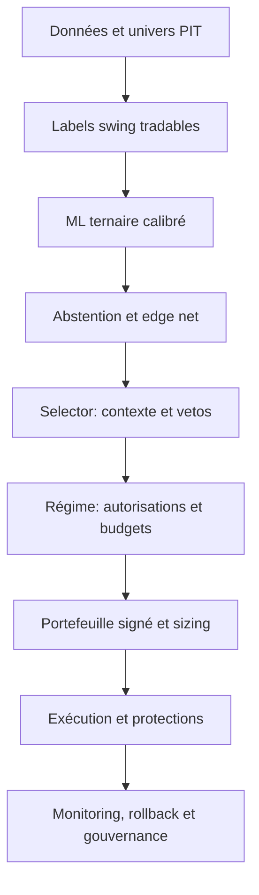

# Roadmap maître ML-first et gestion du risque swing trading

**Date de référence :** 2026-07-11  
**Sources fusionnées :** `prompt/ml.md` et `prompt/rique.md`  
**Statut :** plan prospectif ; aucun sprint n'est terminé sans son gate de sortie  
**Cible :** chaîne professionnelle de swing trading US long/flat/short, depuis les données PIT jusqu'au go-live progressif

---

## 1. Rôle de ce document

Ce document est désormais **l'ordre d'exécution canonique** des travaux ML et risque.

- `prompt/ml.md` reste l'audit et le cahier technique détaillé du ML.
- `prompt/rique.md` reste l'audit et le cahier technique détaillé du risque.
- `prompt/md_risque.md` fixe l'ordre réel, les dépendances et les gates communs.

La fusion n'est pas un simple enchaînement de 11 sprints ML puis de 9 sprints risque. La validation financière ML doit utiliser le moteur de risque cible ; l'edge net, le sizing, les coûts et l'abstention doivent être conçus ensemble ; la parité, le shadow et le paper trading doivent valider la chaîne complète.

---

## 2. Principe d'architecture non négociable



### Autorités

| Composant | Autorité |
|---|---|
| ML | côté long/flat/short, probabilité, expected edge et ranking par côté |
| Selector | features PIT, explications et vetos indépendants ; aucun side ou reranking nominal |
| Régime | côtés autorisés, budget, slots, gross/net et actions défensives |
| Risque | taille et portefeuille final sous contraintes signées |
| Exécution | prix, ordres, protections, fills et réconciliation |
| Gouvernance | promotion, arrêt, rollback et montée du capital |

Un composant aval peut refuser ou réduire un trade, mais ne doit pas recréer un signal alpha concurrent.

---

## 3. Vue d'ensemble des 16 sprints maîtres

| Ordre | Sprint maître | Sources couvertes | Résultat principal |
|---:|---|---|---|
| 0 | Baseline et décision ternaire | ML 0 | contrat de décision unique |
| 1 | Métriques, calibration et champion | ML 1 | gouvernance ML mathématiquement valide |
| 2 | Données PIT et univers historique | ML 2 | absence de fuite et survivorship bias |
| 3 | Labels swing réellement tradables | ML 3 | target alignée sur l'exécution |
| 4 | Benchmark modèles et anti-collapse | ML 4 | architecture ML robuste retenue |
| 5 | Contrat ML vers risque | Risque 0 | rankings et responsabilités figés |
| 6 | Contraintes directionnelles et configuration | Risque 1-2 | moteur long/short cohérent et configurable |
| 7 | Walk-forward financier intégré | ML 5 | alpha OOS validé avec le vrai risque |
| 8 | Edge net, abstention et sizing | ML 6 + Risque 3 | décision et taille unifiées |
| 9 | Régime et événements | Risque 4 | state machine PIT fail-safe |
| 10 | Liquidité, borrow et capacité | Risque 5 | cibles réellement exécutables |
| 11 | Optimisation portefeuille complet | Risque 6 | portefeuille signé incluant holdings |
| 12 | Parité et protections | ML 7 + Risque 7 | même décision et protection partout |
| 13 | MLOps, drift et rollback | ML 8 | système révocable et observable |
| 14 | Shadow et paper trading | ML 9 + Risque 8 A-C | validation opérationnelle sans capital réel |
| 15 | Go-live progressif | ML 10 + Risque 8 go-live | capital engagé par paliers contrôlés |

### Chemin critique

```text
0 -> 1 -> 2 -> 3 -> 4 -> 5 -> 6 -> 7 -> 8
  -> 9 -> 10 -> 11 -> 12 -> 13 -> 14 -> 15
```

L'ordre est volontairement strict pour les gates. Des tâches préparatoires peuvent avancer en parallèle, mais aucun sprint ne peut être déclaré terminé avant ses dépendances.

---

## 4. Definition of Done commune

Chaque sprint exige :

- critères de sortie tous satisfaits ;
- tests ciblés passés avec `--no-cov` ;
- suite globale et seuil de couverture passés ;
- erreurs de type/lint pertinentes corrigées ;
- artefacts, données, code et configuration fingerprintés ;
- documentation conforme au comportement exécuté ;
- parité backtest/live vérifiée pour toute surface commune ;
- comportement fail-open/fail-closed documenté ;
- rollback défini avant toute activation ;
- décision GO/NO-GO enregistrée.

Un fallback silencieux ne peut jamais convertir un `NO-GO` en `GO`.

---

## Sprint maître 0 — Baseline et décision ternaire

**Source :** ML Sprint 0  
**Priorité :** P0  
**Dépendance :** aucune  
**Mode autorisé après sortie :** recherche uniquement

### Objectif

Définir une seule sémantique long/flat/short et une baseline immuable.

### Tâches

1. Créer une `TernaryDecisionPolicy` partagée par entraînement, évaluation, prédiction et replay.
2. Définir seuils long/short, marge top-2, égalités et probabilités non finies.
3. Figer le timing : features disponibles après clôture J, décision au cutoff, entrée au prochain prix exécutable J+1.
4. Versionner classes, policy, horizon et convention de coûts.
5. Produire une baseline JSON sur SPY, secteurs et symboles représentatifs.
6. Ajouter le statut `research_only` bloquant paper/live.

### Tests obligatoires

- parité de la policy entre évaluation et prédiction ;
- entrée toujours postérieure au cutoff des features ;
- gestion déterministe des égalités, NaN et probabilités invalides ;
- blocage de l'exécution pour un modèle `research_only`.

### Gate de sortie

- une seule fonction décide du side ;
- parité side de 100 % sur fixture ;
- baseline et fingerprints archivés ;
- exécution réelle impossible.

---

## Sprint maître 1 — Métriques, calibration et champion

**Source :** ML Sprint 1  
**Priorité :** P0  
**Dépendance :** Sprint maître 0

### Objectif

Garantir que les métriques sont valides, représentent la policy servie et ne contaminent pas le holdout.

### Tâches

1. Corriger les métriques one-vs-rest et multiclasses par symbole.
2. Corriger l'optimiseur ternaire pour traiter short, flat et long.
3. Calibrer les trois probabilités et décider avec les probabilités calibrées.
4. Sélectionner le champion sur validation/walk-forward, jamais sur test final.
5. Bloquer AUC hors bornes, probabilités invalides, classe inconnue et collapse.
6. Invalider puis reconstruire les artefacts gouvernés par les anciennes métriques.

### Tests obligatoires

- AUC, Brier, NLL et probabilités bornés ;
- somme des probabilités égale à 1 à tolérance fixée ;
- calibration utilisée par la décision finale ;
- holdout final incapable de changer le champion ;
- modèle collapsed inéligible.

### Gate de sortie

- zéro métrique invalide ;
- side identique entre évaluation et prédiction ;
- aucune lecture du test dans la sélection ;
- anciens artefacts retirés du service.

---

## Sprint maître 2 — Données PIT et univers historique

**Source :** ML Sprint 2  
**Priorité :** P0/P1  
**Dépendance :** Sprint maître 1

### Objectif

Éliminer look-ahead, survivorship bias et dérive silencieuse des features.

### Tâches

1. Enregistrer `event_time`, `available_at`, timezone, source, révision et ingestion.
2. Exiger `available_at <= decision_cutoff` pour toutes les features.
3. Utiliser l'univers tradable PIT avec delistings et changements de ticker.
4. Séparer prix ajustés pour features et prix exécutables pour fills.
5. Figer les ranks cross-sectionnels sur le fingerprint d'univers.
6. Remplacer les valeurs manquantes ambiguës par états de qualité explicites.
7. Produire le rapport quotidien de couverture et fraîcheur.

### Tests obligatoires

- feature future exclue ;
- symbole délisté présent dans l'historique approprié ;
- split sans altération du prix exécutable ;
- rank reproductible sur snapshot identique ;
- données critiques stale bloquées ou explicitement dégradées.

### Gate de sortie

- zéro observation future dans le golden dataset ;
- univers sans survivorship bias démontré ;
- 100 % des prédictions avec cutoff, qualité et fingerprints ;
- aucune sentinelle numérique ambiguë pour donnée absente.

---

## Sprint maître 3 — Labels swing réellement tradables

**Source :** ML Sprint 3  
**Priorité :** P1  
**Dépendance :** Sprint maître 2

### Objectif

Aligner les labels sur un trade swing réellement exécutable.

### Tâches

1. Implémenter le triple-barrier avec entrée au prochain open tradable.
2. Définir stop/TP en ATR et horizon maximal en sessions.
3. Déterminer le premier barrier touché avec convention intraday explicite.
4. Déduire spread, commission, slippage et impact.
5. Gérer gaps au prix exécutable, jamais au niveau théorique.
6. Produire côté, retour net, durée, MAE, MFE et raison de sortie.
7. Optimiser les paramètres uniquement dans chaque fold train.
8. Comparer target fixe, triple-barrier et ranking cross-sectionnel.

### Tests obligatoires

- premier barrier correctement sélectionné ;
- gap à travers stop exécuté au prix disponible ;
- coûts capables de transformer un gain brut en non-trade/perte ;
- aucun label ne traverse la frontière du fold ;
- symétrie long/short sur série inversée.

### Gate de sortie

- parité label/backtest de 100 % sur scénarios déterministes ;
- coûts partagés avec le moteur de backtest ;
- target sans fuite inter-fold ;
- rapport d'ablation archivé.

---

## Sprint maître 4 — Benchmark modèles et anti-collapse

**Source :** ML Sprint 4  
**Priorité :** P1  
**Dépendance :** Sprint maître 3

### Objectif

Retenir l'architecture la plus simple qui généralise sans collapse.

### Tâches

1. Ajouter baselines always-flat, momentum, mean-reversion et logistique.
2. Comparer LightGBM, CatBoost, modèle global/sectoriel et LSTM.
3. Calculer les poids de classes sur train uniquement.
4. Tester régularisation, focal loss et sampling pondéré.
5. Mesurer stabilité multi-seeds, latence, mémoire et coût de service.
6. Rejeter modèle inférieur aux baselines, collapsed ou instable.
7. Retirer le LSTM s'il n'apporte pas de gain robuste aux modèles tabulaires.

### Tests obligatoires

- folds et coûts identiques pour tous les challengers ;
- class weights entraînés sur train seulement ;
- collapse bloquant ;
- reproductibilité à seed fixe ;
- stabilité entre seeds mesurée.

### Gate de sortie

- champion non collapsed ;
- gain crédible face aux baselines ;
- architecture justifiée par performance nette et complexité ;
- latence compatible avec la fenêtre EOD.

---

## Sprint maître 5 — Contrat ML vers risque

**Source :** Risque Sprint 0  
**Priorité :** P0  
**Dépendance :** Sprints maîtres 0 à 4

### Objectif

Figer la frontière entre alpha ML, contexte selector et autorité risque avant la validation financière.

### Tâches

1. Définir `MLRankedCandidate` avec side, `p_side`, edge, rank par côté et lineage.
2. Produire deux rankings distincts : long et short.
3. Définir `SelectorVetoContext` sans autorité de side/ranking.
4. Retirer `tag_short_candidates` et le score-first du chemin nominal.
5. Définir la séquence ML → vetos → régime → portefeuille.
6. Rendre trade date, account, universe, model et config IDs obligatoires.
7. Déprécier les APIs legacy ambiguës.

### Tests obligatoires

- ML seul détermine side et ordre nominal ;
- selector incapable de changer side/rank ;
- flat n'atteint jamais le sizing ;
- lineage et trade date obligatoires ;
- rankings long/short conservés par le bridge.

### Gate de sortie

- aucun top selector comme univers nominal ;
- aucune date système implicite ;
- 100 % des décisions rattachées aux snapshots ;
- contrat consommable par live et backtest.

---

## Sprint maître 6 — Contraintes directionnelles et configuration

**Sources :** Risque Sprints 1 et 2  
**Priorité :** P0  
**Dépendance :** Sprint maître 5

### Objectif

Construire le socle risque long/short qui sera utilisé par la validation financière ML.

### Tâches directionnelles

1. Ajouter comptes et notionnels long/short au `PortfolioState`.
2. Appliquer caps total, long et short.
3. Calculer gross/net sur poids signés.
4. Corriger le stop initial : long sous l'entrée, short au-dessus.
5. Calculer corrélation de PnL signée.
6. Appliquer beta et facteurs sur poids signés finaux.
7. Revalider toutes les contraintes après réduction et arrondi.

### Tâches de configuration

1. Créer un loader `RiskConfig` unique pour YAML, preset, CLI, IHM et backtest.
2. Définir la priorité defaults < YAML < preset < override autorisé.
3. Refuser clés inconnues et champs déclarés mais non consommés.
4. Charger factor model, ADV, short policy, neutralité, Kelly et caps.
5. Persister la configuration effective et son fingerprint.
6. Exiger un snapshot broker frais en paper/live.

### Tests obligatoires

- caps long/short appliqués ;
- ranking séparé respecté ;
- stop du côté adverse pour les deux sides ;
- corrélation PnL signée correcte ;
- contraintes satisfaites après arrondi ;
- configuration effective identique backtest/live ;
- chaque clé déclarée consommée ou rejetée.

### Gate de sortie

- zéro dépassement directionnel sur property tests ;
- zéro paramètre décoratif ;
- fingerprint différent pour toute différence effective ;
- moteur minimal suffisamment stable pour le walk-forward financier.

---

## Sprint maître 7 — Walk-forward financier intégré

**Source :** ML Sprint 5  
**Priorité :** P1  
**Dépendance :** Sprint maître 6

### Objectif

Valider l'alpha OOS avec le contrat et les contraintes risque qui seront réellement servis.

### Tâches

1. Mettre en place nested walk-forward avec purge et embargo.
2. Tuner en interne, sélectionner sur validation et préserver le test externe.
3. Rejouer chaque fold avec le moteur risque du Sprint maître 6.
4. Mesurer long, short et combiné : rendement, Sharpe, Sortino, Calmar, drawdown, turnover, exposition et coûts.
5. Segmenter par régime, secteur, market cap, ADV et earnings.
6. Ajouter block bootstrap, Deflated Sharpe et correction multiple testing.
7. Évaluer performance sans les meilleurs trades et stabilité entre folds.
8. Produire un score de promotion dimensionnellement cohérent.

### Tests obligatoires

- outer test jamais utilisé pour tuning ;
- purge/embargo retirant les labels chevauchants ;
- métriques nettes de coûts ;
- long + short réconciliés avec combiné ;
- mêmes signaux/PnL entre replay et backtest sur fixture.

### Gate de sortie

- au moins 70 % des folds OOS positifs nets de coûts ;
- Sharpe OOS médian >= 1,0 et 25e percentile > 0 ;
- profit factor >= 1,20 ;
- coûts <= 35 % de l'alpha brut ;
- drawdown sous budget ;
- aucune jambe activée structurellement non validée ;
- holdout externe intact.

---

## Sprint maître 8 — Edge net, abstention et sizing

**Sources :** ML Sprint 6 et Risque Sprint 3  
**Priorité :** P1  
**Dépendance :** Sprint maître 7

### Objectif

Transformer ensemble probabilité, incertitude, coûts et risque en décision de trade et taille.

### Tâches ML

1. Mesurer calibration multiclasses par régime.
2. Ajouter abstention par confiance, entropie, marge top-2, qualité et distance au domaine train.
3. Estimer rendement conditionnel et `edge_net`.
4. Optimiser seuils au niveau portefeuille.

### Tâches risque

1. Remplacer l'accuracy générique par statistiques OOS par side/régime.
2. Utiliser hit rate, payoff, tail loss, calibration et taille d'échantillon.
3. Appliquer shrinkage bayésien sur petits échantillons.
4. Rejeter par défaut edge net faible/négatif ; supprimer le fallback Kelly implicite vers ATR.
5. Séparer payoff long et short.
6. Combiner ATR, expected shortfall et risque gap overnight.
7. Recalculer quantité et stop après fill sans dépasser le budget.

### Tests obligatoires

- incertitude entraînant abstention ;
- coûts plus élevés ne pouvant augmenter edge/taille ;
- edge négatif rejeté ;
- statistiques OOS directionnelles ;
- petit échantillon shrinké ;
- gap/ES réduisant la taille ;
- risque post-fill sous budget.

### Gate de sortie

- edge net positif obligatoire ;
- aucune métrique du holdout final utilisée pour le sizing ;
- calibration et payoff séparés par side ;
- courbe performance/couverture archivée ;
- somme du risque initial sous budget portefeuille.

---

## Sprint maître 9 — Régime et événements

**Source :** Risque Sprint 4  
**Priorité :** P1  
**Dépendance :** Sprint maître 8

### Objectif

Transformer régime et événements en state machine PIT directionnelle et fail-safe.

### Tâches

1. Définir états normal, warning, capital preservation et recovery.
2. Versionner côtés autorisés, risk multiplier, gross/net, slots et secteurs par état.
3. Distinguer blocage d'entrée, réduction, hedge et liquidation.
4. Garantir hystérésis et durée minimale.
5. Traiter positions existantes, ordres ouverts et partial fills lors des transitions.
6. Classifier données/contrôles critiques et overlays facultatifs.
7. Fail-closed sur earnings, tradabilité et contrôles critiques.
8. Fail-degraded conservateur sur overlay macro facultatif.
9. Supprimer tout rescoring selector du risque.

### Tests obligatoires

- régime changeant budget mais pas ranking ML ;
- hystérésis empêchant flip-flop ;
- donnée événementielle critique manquante bloquant l'entrée ;
- transitions avec positions et ordres ouverts ;
- parité state machine backtest/live.

### Gate de sortie

- aucune exception sécurité fail-open ;
- aucun side/rank ML réécrit ;
- actions de transition auditables ;
- stress V-shaped recovery, vol spike et yield shock validés.

---

## Sprint maître 10 — Liquidité, borrow et capacité

**Source :** Risque Sprint 5  
**Priorité :** P1  
**Dépendance :** Sprint maître 9

### Objectif

Garantir que chaque cible est exécutable et liquidable dans les conditions prévues.

### Tâches

1. Exiger ADV, spread et fraîcheur de quote.
2. Définir participation maximale à l'entrée et en liquidation stressée.
3. Ajouter `BorrowSnapshot` PIT : shortable, ETB/HTB, quantité, fee, locate et timestamp.
4. Déduire borrow fee et recall risk de l'edge short.
5. Bloquer HTB sans locate confirmé.
6. Modéliser slippage par ADV, spread, volatilité et taille.
7. Simuler partial fills, ordre non exécuté et liquidation multi-jours.
8. Estimer capacité par stratégie, secteur et symbole.

### Tests obligatoires

- ADV/quote absent ou stale bloquant l'entrée ;
- participation cap respectée ;
- symbole non shortable bloqué ;
- borrow fee réduisant edge/taille ;
- partial fill respectant le budget.

### Gate de sortie

- 100 % des entrées avec liquidité fraîche ;
- 100 % des shorts avec borrow validé ;
- coûts stressés persistés ;
- capacité maximale et plan de liquidation chiffrés.

---

## Sprint maître 11 — Optimisation portefeuille complet

**Source :** Risque Sprint 6  
**Priorité :** P1  
**Dépendance :** Sprint maître 10

### Objectif

Optimiser positions existantes et nouvelles cibles comme un portefeuille signé unique.

### Tâches

1. Inclure holdings, cash, buying power, ordres ouverts et protections.
2. Optimiser edge sous contraintes risk, gross/net, side, secteur, facteur, corrélation, ADV et turnover.
3. Ajouter concentration industrie, thème, pays, devise et gap single-name.
4. Mesurer marginal contribution to risk et expected shortfall.
5. Remplacer le rejet greedy par la réduction du candidat le plus dégradant.
6. Ajouter coûts de turnover et no-trade bands.
7. Garantir déterminisme, explications et fallback conservateur.
8. Revalider après arrondis et fractional shares.

### Tests obligatoires

- holdings existants inclus ;
- toutes les contraintes signées satisfaites ;
- no-trade bands réduisant turnover ;
- résultat déterministe ;
- arrondi revalidé ;
- fallback ne produisant jamais plus de risque.

### Gate de sortie

- zéro violation après arrondi ;
- ES et facteurs sous budgets ;
- turnover inférieur au greedy à edge comparable ;
- temps de résolution compatible EOD ;
- explication de chaque réduction/rejet persistée.

---

## Sprint maître 12 — Parité et protections

**Sources :** ML Sprint 7 et Risque Sprint 7  
**Priorité :** P0 avant shadow/paper  
**Dépendance :** Sprint maître 11

### Objectif

Garantir la même décision de bout en bout et une protection directionnelle permanente.

### Tâches de parité

1. Partager features, policy, modèle, seuils, coûts et config entre replay, paper et live.
2. Persister inputs, timestamps, fingerprints, probabilités, vetos, sizing et prix attendu.
3. Rejouer une journée live depuis l'audit log.
4. Garantir idempotence des prédictions et décisions.
5. Bloquer schéma, artefact, scaler ou calibrateur incompatibles.
6. Éliminer les fallbacks silencieux.

### Tâches de protection

1. Poser stop long sous l'entrée et stop short au-dessus.
2. Recalculer stop et risque après fill.
3. Définir TP, trailing, break-even et time stop par side/régime.
4. Garantir OCO logique et quantités protégées égales aux fills.
5. Gérer gap, partial fill, split, halt, rejet et reconnexion broker.
6. Définir SLA de protection et réparation automatique.
7. Tester force-close avec ordres enfants ouverts.
8. Persister R, MAE, MFE et raison de sortie.

### Tests obligatoires

- snapshot identique donnant features, probabilités, side et taille identiques ;
- prédiction/décision idempotente ;
- stops du côté adverse ;
- partial fill protégé à quantité exacte ;
- gap exécuté au prix disponible ;
- position nue réparée ;
- force-close annulant les ordres conflictuels.

### Gate de sortie

- parité discrète de 100 % ;
- lineage complet pour 100 % des cibles ;
- 100 % des positions protégées dans le SLA ;
- risque post-fill réconcilié ;
- aucun chemin paper/live en fallback silencieux.

---

## Sprint maître 13 — MLOps, drift et rollback

**Source :** ML Sprint 8  
**Priorité :** P1 avant production  
**Dépendance :** Sprint maître 12

### Objectif

Rendre l'ensemble observable, révocable et récupérable.

### Tâches

1. Registry : candidate, shadow, paper, champion, degraded et retired.
2. Fraîcheur maximale pour données, modèle, calibration, régime et borrow.
3. Surveiller drift features, probabilités, sides, calibration, PnL, coûts et exposition.
4. Déclencher rollback/circuit breaker sur intégrité, staleness, drawdown ou drift sévère.
5. Définir retraining périodique/événementiel et champion/challenger.
6. Ajouter canary release.
7. Tester sauvegarde, restauration et disaster recovery.
8. Exposer état, cause, scope, sévérité et action opérateur.

### Tests obligatoires

- drift sévère bloquant les nouvelles entrées ;
- rollback atomique du champion ;
- modèle stale non servi ;
- restauration reproduisant la prédiction ;
- kill switch et alertes testés.

### Gate de sortie

- artefact incompatible impossible à servir ;
- rollback réussi en moins de 5 minutes ;
- aucun nouvel ordre pendant rollback ;
- dashboard et rapport quotidien disponibles ;
- restauration validée sur environnement propre.

---

## Sprint maître 14 — Shadow et paper trading

**Sources :** ML Sprint 9 et Risque Sprint 8 phases A-C  
**Priorité :** P0 avant capital réel  
**Dépendance :** Sprints maîtres 0 à 13

### Objectif

Valider la chaîne complète sur des données réellement arrivées, sans capital réel.

### Phase A — Golden parity

1. Utiliser une fixture PIT unique pour backtest, risk replay, paper et live dry-run.
2. Comparer univers, prédictions, rankings, vetos, régime, tailles, contraintes, stops et raisons.
3. Migrer tous les tests bridge au contrat ternaire.
4. Exiger tolérance zéro sur side/rejet et tolérance numérique documentée sur tailles.

### Phase B — Shadow, minimum 4 semaines

1. Produire les cibles sans ordre.
2. Vérifier disponibilité réelle des features au cutoff.
3. Mesurer latence, couverture, staleness et divergences replay/live.
4. Simuler fills depuis les quotes observées.
5. Exécuter incidents simulés et rollback.

### Phase C — Paper, minimum 8 à 12 semaines

1. Envoyer les ordres au broker paper avec contraintes réelles.
2. Mesurer fills, partial fills, slippage, rejets, borrow et protections.
3. Vérifier PnL et calibration par cohorte, side et régime.
4. Recalibrer uniquement les hypothèses de coûts sur fills paper.
5. Geler les changements majeurs pendant la fenêtre d'évaluation.
6. Revoir chaque semaine pertes extrêmes, meilleurs gains et abstentions.

### Tests et drills

- E2E IHM → ML → risque → exécution → protection → réconciliation ;
- bridge backtest/risque entièrement vert ;
- chaos DB, données, registry, macro, borrow, broker et watcher ;
- replay nocturne identique à la décision auditée ;
- au moins un cycle champion/challenger sans incident.

### Gate de sortie

- divergence side/rejet : 0 ;
- violation de cap : 0 ;
- position sans protection hors SLA : 0 ;
- short sans borrow : 0 ;
- donnée critique future/stale : 0 ;
- config fingerprint divergent : 0 ;
- slippage médian <= 1,25 fois l'hypothèse ;
- drawdown sous budget ;
- incident critique ou majeur ouvert : 0 ;
- rollback et kill switch réussis ;
- comité GO/NO-GO documenté.

---

## Sprint maître 15 — Go-live progressif

**Sources :** ML Sprint 10 et Risque Sprint 8 go-live  
**Priorité :** P0 production  
**Dépendance :** validation formelle du Sprint maître 14

### Objectif

Engager du capital de manière graduelle, manuelle, réversible et mesurable.

### Tâches

1. Démarrer à 5 % du budget risque, sur univers le plus liquide.
2. Monter par paliers `5 % -> 10 % -> 25 % -> 50 % -> 100 %`.
3. Exiger une fenêtre minimale et une revue humaine à chaque palier.
4. Maintenir champion précédent et rollback atomique.
5. Activer stop opérationnel, limite de pertes, drawdown breaker et kill switch.
6. Réconcilier quotidiennement ordres, fills, positions, protections et PnL.
7. Revoir mensuellement attribution, régimes, coûts, drift, capacité et incidents.
8. Réaliser une revue indépendante trimestrielle.
9. Maintenir le journal immuable des changements et overrides.

### Gate de montée d'un palier

- aucun incident critique depuis le palier précédent ;
- performance dans l'intervalle attendu ;
- drawdown, slippage et coûts sous limites ;
- calibration et couverture stables ;
- aucune concentration imprévue ;
- capacité et impact compatibles avec le palier suivant ;
- rollback drill récent et réussi ;
- approbation humaine enregistrée.

### Contrôles permanents

- smoke test avant session ;
- fraîcheur et intégrité quotidiennes ;
- parité backtest/live quotidienne ;
- réconciliation quotidienne ;
- rollback drill mensuel ;
- restauration complète trimestrielle.

### Critère de sortie

Ce sprint devient le processus d'exploitation permanent. Le passage à 100 % n'est jamais automatique et exige plusieurs périodes et régimes observés sans dégradation des gates.

---

## 5. Travaux parallèles autorisés

Les gates restent séquentiels, mais les préparations suivantes peuvent avancer :

| Pendant | Travail parallèle autorisé | Interdiction |
|---|---|---|
| Sprints 0-1 | fixtures PIT, inventaire lineage | changer le contrat de side hors policy |
| Sprint 2 | prototype triple-barrier | entraîner sur données non auditées |
| Sprint 3 | étude coûts et microstructure | optimiser sur holdout |
| Sprint 4 | schéma `MLRankedCandidate` | brancher un ranking selector nominal |
| Sprint 5 | tests contraintes signées | figer des seuils avant config unique |
| Sprint 6 | infrastructure nested walk-forward | valider financièrement avec ancien risque |
| Sprint 7 | prototypes abstention/Kelly | utiliser test final pour sizing |
| Sprints 8-10 | solveur portefeuille et borrow adapters | activer paper/live |
| Sprint 11 | lineage et watcher de protection | démarrer shadow avant parité |
| Sprints 12-13 | documentation opérateur et drills | engager du capital |
| Sprint 14 | recherche challenger isolée | modifier le champion en cours d'évaluation |

---

## 6. Traçabilité complète des anciens sprints

### ML

| Ancien sprint | Nouveau sprint maître | Couverture |
|---|---:|---|
| ML 0 | 0 | baseline, policy, timing, research-only |
| ML 1 | 1 | métriques, calibration, champion, holdout |
| ML 2 | 2 | disponibilité PIT et univers historique |
| ML 3 | 3 | triple-barrier et coûts tradables |
| ML 4 | 4 | baselines, modèles, collapse et seeds |
| ML 5 | 7 | nested walk-forward financier avec vrai risque |
| ML 6 | 8 | incertitude, abstention, edge et sizing |
| ML 7 | 12 | parité backtest/paper/live et lineage |
| ML 8 | 13 | registry, drift, rollback et recovery |
| ML 9 | 14 | shadow et paper |
| ML 10 | 15 | go-live progressif |

### Risque

| Ancien sprint | Nouveau sprint maître | Couverture |
|---|---:|---|
| Risque 0 | 5 | contrat sélection vers risque |
| Risque 1 | 6 | contraintes directionnelles et stops |
| Risque 2 | 6 | configuration unique et fingerprint |
| Risque 3 | 8 | statistiques directionnelles, Kelly et ES |
| Risque 4 | 9 | state machine régime et événements |
| Risque 5 | 10 | liquidité, borrow et capacité |
| Risque 6 | 11 | optimisation portefeuille complet |
| Risque 7 | 12 | protections et lifecycle |
| Risque 8 | 14-15 | parity, shadow, paper et go-live |

**Contrôle de couverture :** 11/11 sprints ML et 9/9 sprints risque sont représentés.

---

## 7. Niveaux d'utilisation autorisés

| Dernier sprint validé | Niveau autorisé |
|---:|---|
| 0-4 | recherche ML uniquement |
| 5-6 | recherche intégrée ML/risque |
| 7 | candidat alpha quantitativement crédible, sans ordre |
| 8-11 | moteur de décision/portefeuille candidat, sans ordre réel |
| 12-13 | shadow autorisé |
| 14 | paper validé, décision GO/NO-GO possible |
| 15 | réel progressif selon palier approuvé |

**Aucun capital réel avant la clôture formelle du Sprint maître 14.**

---

## 8. Gates globaux de production

| Domaine | Gate bloquant |
|---|---|
| PIT | aucune donnée disponible après cutoff |
| Modèle | probabilités calibrées, stables, non collapsed |
| Holdout | jamais utilisé pour tuning, champion ou sizing |
| Alpha | performance OOS nette robuste aux coûts et régimes |
| Autorité | ML seul détermine side et ranking nominal |
| Risque | caps et budgets signés sans violation |
| Liquidité | ADV/spread frais et liquidation réalisable |
| Short | borrow validé et coût déduit de l'edge |
| Parité | décision discrète identique backtest/paper/live |
| Protection | aucune position nue hors SLA |
| Configuration | fingerprint identique entre environnements |
| Opérations | rollback, kill switch et recovery testés |
| Paper | fenêtre minimale et coûts réels acceptables |
| Gouvernance | GO humain et audit trail complet |

Un seul gate bloquant en échec impose `NO-GO` ou retour au palier précédent.

---

## 9. Checklist de pilotage

- [ ] sprint maître courant identifié ;
- [ ] dépendances précédentes clôturées ;
- [ ] owner ML et/ou risque nommé ;
- [ ] tests obligatoires écrits ;
- [ ] tests ciblés puis globaux verts ;
- [ ] artefacts et rapports archivés ;
- [ ] anomalies sources reliées aux changements ;
- [ ] parité vérifiée ;
- [ ] risque résiduel accepté explicitement ;
- [ ] rollback testé ;
- [ ] décision GO/NO-GO enregistrée ;
- [ ] document maître mis à jour avant le sprint suivant.
