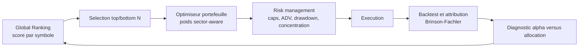

# Plan d'action - Global Ranking, per-symbol et per-sector

**Date :** 2026-08-05  
**Decision de depart :** les huit campagnes `per_sector` ne demontrent aucun alpha tradable avec les donnees, les cibles et les modeles **par defaut** testes. Le mode ne doit donc pas etre utilise comme signal de trading ou champion de production tant qu'une campagne de recherche bornee n'a pas demontre le contraire.  
**But :** exploiter l'information sectorielle la ou elle est la plus utile - construction et controle du portefeuille - tout en conservant le Global Ranking comme source de selection des titres.

---

## 1. Reponse courte : le secteur reste utile

La conclusion n'est pas « abandonner le secteur ». Elle est : **ne pas demander a onze modeles isoles de predire un residu intra-sectoriel tres bruite avec les memes features generiques.**

Les professionnels combinent habituellement trois roles distincts :

| Couche | Question | Objet principal | Responsable |
|---|---|---|---|
| Alpha / ML | Quels titres semblent meilleurs ou pires ? | Score cross-sectionnel par titre | `modelFactory` / Global Ranking |
| Construction de portefeuille | Quels poids donnent un portefeuille diversifie et coherent ? | Poids, exposition nette/gross, contraintes secteur | nouveau portefeuille sector-aware |
| Risque / execution | Le portefeuille peut-il etre autorise et execute ? | Caps, liquidite, drawdown, concentration, ADV | `risk_management`, `execution_engine`, `backtesting` |

Le secteur intervient dans les trois couches, mais avec des responsabilites differentes. Un cap sectoriel ne cree pas d'alpha; il empeche qu'un bon score global soit transforme en pari excessif sur un seul secteur. Inversement, un score ML ne doit pas contourner une contrainte de concentration.

### 1.1 Architecture cible

Le `per_sector` actuel reste disponible uniquement en **shadow research** : il peut produire des diagnostics, mais ne peut ni modifier un score global, ni filtrer une entree, ni changer un poids reel.

---

## 1.2 Correction de la conclusion : baseline rejete, hypotheses encore ouvertes

Il serait trop fort d'affirmer que les families de features, le feature engineering ou le tuning sont « inutiles ». Les batchs montrent seulement ceci :

* la configuration `expert` et ses hyperparametres fixes (`depth=5`, `200` arbres, etc.) ne trouve pas de signal per-sector exploitable;
* le contraste « tous les flags actives » versus « aucun flag » ne montre aucun gain visible dans cette configuration;
* ce contraste n'est **pas** une ablation causale de chaque famille et ne permet pas de conclure sur XS, fondamentales, facteurs ou macro pris separement;
* ni per-sector ni per-symbol ne doivent aujourd'hui etre promus en production sur la seule base de F1/DA de batch.

Le batch per-symbol `71ad0b` est au contraire un motif pour faire un test propre, pas pour conclure : CatBoost atteint `57.2 %` de directional accuracy WF et LightGBM `54.6 %` sur dix titres. Cela est plus prometteur que le per-sector, mais reste insuffisant comme preuve car l'echantillon contient seulement dix titres issus de `ticket-recherche`, sans comparaison appariée au Global Ranking ni mesure de portefeuille nette de couts. Le LSTM est a mettre hors competition pour ce protocole : son MSE WF moyen est `39.93`, contre environ `1.15` pour les arbres, ce qui revele une sortie non calibree ou une incoherence d'echelle a diagnostiquer avant toute aggregation.

**Precision sur les metriques :** dans le WF de regression, la cible est winsorisee et standardisee avec les statistiques du train du fold. La directional accuracy compare le signe de cette cible transformee au signe de la prediction corrigee du biais. C'est une mesure de prediction de la cible apprise, mais ce n'est pas a elle seule la preuve d'une direction economique de `future_return`. Tout protocole ci-dessous doit donc rapporter, a cote de DA/F1 : IC par date contre rendement brut, spread long-short, PnL net de couts et stabilite par fold.

**Selection des champions :** le selecteur courant classe bien les challengers sur F1 WF puis validation, sans utiliser `test` dans `selection_score_from_result`. Le chemin LSTM renseigne toutefois un champ interne `selection_score` a partir de `test_metrics` quand elles existent; ce champ n'est pas utilise par le selecteur actuel, mais doit etre aligne sur WF/validation pour eviter une future regression de gouvernance.

### 1.3 Decision d'execution : etudier les deux modes, sans diluer le protocole

Les deux modes sont maintenus en recherche, mais ils n'ont ni la meme priorite ni le meme droit a une promotion :

| Ordre | Mode | Etat | Prochaine decision |
|---:|---|---|---|
| 0 | Global Ranking | Controle commun | Reproduire le baseline et fournir la comparaison economique a tous les challengers. |
| 1 | Per-symbol | Priorite de recherche | Etendre le pilote `71ad0b` de 10 a 50-100 titres liquides et apparies au Global Ranking. |
| 2 | Per-sector | Recherche bornee | Executer F0-F4 et le tuning H20 limite; clore la piste generique si les gates economiques echouent. |
| - | LSTM per-symbol | Quarantaine | Ne pas le promouvoir avant resolution de son MSE WF hors echelle. |

Le batch `71ad0b` est consigne comme **pilote prometteur mais non concluant** : CatBoost (`DA WF=57.24 %`) et LightGBM (`54.61 %`) meritent une replication; le resultat ne permet pas de choisir un champion de production ni d'inferer une performance sur l'univers complet. Les dix titres proviennent de `ticket-recherche`, l'option `--per-symbol-max-symbols` n'a pas fige une population liquide representative, et aucun backtest portefeuille apparié n'est encore fourni.

**Regle de ressources :** ne pas lancer simultanement les cinq ablations et toutes les grilles de tuning pour les deux modes. Terminer F0 et les controles simples per-symbol, lire les IC/spreads, puis seulement lancer F1-F4. Le per-sector suit le meme ordre, mais ne consomme pas plus d'un cycle H20 apres ses controles. Cette discipline protege contre le multiple testing et rend un echec interpretable.

---

## 2. Pourquoi onze modeles per-sector echouent plus facilement

### 2.1 Taille effective de l'echantillon

Le Global Ranking compare environ 900 actions le meme jour. Un secteur contient souvent quelques dizaines de titres seulement, parfois moins selon l'historique, les filtres de liquidite ou les donnees fondamentales disponibles. La taille pertinente pour un ranking est le nombre de titres **par date**, pas seulement le total de lignes historique.

Pour une cible relative, le modele doit discerner de faibles ecarts entre titres tres correles. Apres soustraction de la mediane sectorielle, il reste approximativement :

$$
r_{i,t}^{relative} = r_{i,t} - \operatorname{median}_{j \in secteur(i)}(r_{j,t})
$$

Cette cible est propre pour mesurer du stock-picking, mais son ratio signal/bruit est faible. Diviser le panel en onze estimateurs retire une partie de la regularisation implicite et augmente le risque de memorisation des identites `symbol`.

### 2.2 Lecture correcte des huit batchs

Les campagnes testent plusieurs causes plausibles : XS/fondamentales reelles, flags, horizon, vol scaling, cible de rang et classification ternaire. Le resultat est invariant : les variantes continues restent autour de $50\%$ de directional accuracy et la classification T3 se degrade de pres de $70\%$ en validation vers $39\%$ en walk-forward.

Ce resultat exclut la poursuite non bornee de recherches incrementalistes du type « encore une profondeur », « encore un flag », ou « encore un seuil ». Il justifie en revanche une campagne courte, preregistree et appariée, qui peut invalider ou conserver les hypotheses suivantes :

* des variables propres a un secteur et disponibles PIT;
* un objectif top-down d'allocation d'ETF/indices sectoriels;
* un modele global avec interactions sectorielles;
* une optimisation de poids qui neutralise le secteur sans predire chaque residu par secteur.

---

## 2.3 Campagne ML bornee avant verdict definitif

Cette campagne vient **avant** toute promotion per-symbol/per-sector, mais ne bloque pas les Phases A-B de portefeuille Global Ranking. Les univers, dates, seeds, couts, folds et code SHA doivent etre identiques a l'interieur de chaque comparaison. Le holdout final est consulte une seule fois pour le vainqueur preregistre.

### A. Etablir les controles simples

Pour chaque mode et horizon, comparer les arbres a des baselines sans apprentissage : prediction zero, momentum 20/60, moyenne mobile de retour, ridge/ElasticNet regularise. Ajouter Random Forest seulement comme controle de variance; ne pas l'attendre comme candidat de production. XGBoost est acceptable comme challenger unique si sa version, ses seeds et sa regularisation sont figees, mais ne doit pas ouvrir une grille de dizaines d'algorithmes.

**Acceptation :** un arbre n'est interessant que s'il bat les controles en IC par date et spread net sur la majorite des folds, pas seulement en F1.

### B. Ablation de features, une famille a la fois

Sur le meme baseline `expert`, evaluer au maximum ces cinq runs par mode :

| ID | Variante | Question |
|---|---|---|
| F0 | `expert` sans famille optionnelle | Reference exacte. |
| F1 | F0 + XS reels | Le ranking cross-sectionnel ajoute-t-il un IC/spread incremental ? |
| F2 | F0 + fondamentales PIT | Les fondamentales ajoutent-elles une information lente ? |
| F3 | F0 + regime macro/interactions | Le regime conditionne-t-il les features locales ? |
| F4 | meilleure famille unique + une seconde preregistree | La combinaison ajoute-t-elle autre chose que du bruit ? |

Les scores short, VIX/VXN/VIX9D/VIX3M/MOVE et CAPM ne doivent pas tous etre ajoutes dans F4. Pour un Global Ranking, une macro identique pour tous les titres le meme jour ne peut aider qu'au travers d'une interaction avec une feature locale ou une politique de portefeuille. Les colonne candidates doivent etre controlees par fold : presence, missing rate, taux de defaults, variance, importance moyenne et stabilite des importances.

### C. Tuning petit et regularisant

Le tuning est justifie, mais seulement apres F0-F4, avec une grille courte et choisie avant de lire le holdout :

| Modele | Trois variantes maximum | Garde-fou |
|---|---|---|
| LightGBM | `depth` 3/5/7, feuilles coherentes, `min_child_samples` 150/300 | preferer la regularisation; pas de recherche exhaustive. |
| CatBoost | profondeur 4/6/7, `l2_leaf_reg` 3/10, iterations 200/500 avec early stopping | meme folds et seed; conserver le plus simple a performance egale. |
| ElasticNet | grille alpha/l1_ratio courte | controle lineaire interpretable. |
| XGBoost | une configuration regularisee equivalente aux arbres existants | challenger unique, pas un nouveau programme de tuning. |

Le choix se fait sur les folds de developpement. Si aucun candidat n'ameliore de maniere coherente l'IC/spread net sur au moins une majorite des folds, le tuning s'arrete.

### D. Protocole per-symbol specifique

1. Former un univers fige de `50-100` titres tres liquides, selectionnes par une regle PIT de volume/ADV et historique suffisant, pas par une liste manuelle `ticket-recherche`.
2. Utiliser `--per-symbol-max-symbols` avec selection stratifee ou top-liquide explicite; enregistrer la liste et les dates par fold.
3. Comparer sur les memes titres/dates : Global Ranking seul, per-symbol CatBoost seul, per-symbol LightGBM seul, puis combinaison bornée Global + per-symbol.
4. La combinaison ne peut modifier le poids que faiblement et seulement si les predictions sont OOF; elle ne doit pas utiliser un score in-sample comme feature live.
5. Exclure temporairement LSTM des champions tant que son MSE/calibration est hors echelle; investiguer ensuite separatément les transformations de target, scaler, predictions et checkpoints.

**Seuil de passage indicatif :** gain positif du spread net et de l'IC par date sur la majorite des folds, pas de degradation materielle de turnover/drawdown, puis confirmation sur holdout. Les 10 titres actuels servent de smoke test, non de preuve.

### E. Protocole per-sector specifique

1. Refaire F0-F4 et le tuning court seulement sur H20, avec les XS/fondamentales deja corrigees et traces.
2. Ajouter des metriques **relatives** par date : IC prediction contre `relative_return`, top-minus-bottom intra-secteur, turnover, couts et nombre de titres par cote.
3. Fixer a l'avance une condition de passage : gain positif contre momentum intra-secteur et zero predictor sur la majorite des folds, plus un holdout positif apres couts.
4. Si cette campagne echoue, clore le per-sector generique pour le dataset actuel. Une reprise exigera alors une donnee sectorielle specialisee et une hypothese economique nouvelle, pas un algorithme supplementaire.

---

## 3. Ce qui concerne le ML, le risque, ou les deux

### 3.1 Module ML uniquement

Ces actions changent le contenu informatif du score, mais ne doivent pas contourner les limites de portefeuille.

1. **Global Ranking comme alpha principal.** Reproduire un baseline avec le code actuel, un manifest, l'univers PIT et les folds reels.
2. **Secteur categoriel et interactions dans un modele global.** Tester `sector`, `sector x momentum`, `sector x valuation`, `sector x volatility` dans le meme modele global. Cela conserve le panel entier au lieu de fragmenter les donnees.
3. **Scores residuels de diagnostic.** Mesurer apres coup le score global conditionnellement au secteur; ne pas entrainer onze champions.
4. **Donnees specialisees.** Une future recherche Energy/Banks/Semis doit commencer par une hypothese economique et une source PIT specifique, pas par un tuning generique.
5. **Evaluation alpha.** IC par date, spread top-bottom, turnover, stabilite inter-fold et holdout gele sont produits par le pipeline ML/backtest.

### 3.2 Risque et construction de portefeuille uniquement

Ces actions ne changent pas la prediction; elles transforment les scores retenus en poids admissibles.

1. **Cap sectoriel gross.** Deja disponible dans `risk_management` via `max_sector_weight` et dans le backtest via `max_sector_exposure_pct`.
2. **Cap par industrie, theme et HHI.** Deja present dans `ConcentrationChecker`; il protege contre le faux confort d'une diversification par noms qui seraient en fait le meme pari economique.
3. **Liquidite/ADV, poids maximum, drawdown, exposition gross et net.** Ce sont des contraintes de risque, independantes de la qualite du ranking.
4. **Garde-fou de production.** Toute proposition de poids doit etre revalidee apres arrondi et avant execution. Les limites restent fail-closed si metadonnees secteur ou ADV sont absentes.

### 3.3 Interface ML - portefeuille - risque

L'optimisation utilise le score et les metadonnees du ML, puis le risque valide le resultat. C'est une interface, pas une fusion des responsabilites.

| Donnee publiee par ML | Utilisation portefeuille | Controle risque |
|---|---|---|
| `global_rank_h`, score signe et horizon | ordre des candidats et alpha attendu relatif | aucun score ne peut depasser les caps |
| incertitude / dispersion OOS | reduire ou annuler un poids | non-utilisation si qualite insuffisante |
| `symbol -> sector`, industrie | calculer expositions et neutralite | fallback `UNKNOWN` bloque ou borne selon politique |
| ADV, volatilite, correlations | poids initial / cout estime | max ADV, gross, HHI, concentration |
| timestamp/fingerprint de features | audit de la decision | rejection si donnees non PIT ou stale |

---

## 4. Strategie recommandee : Global Ranking sector-aware

### 4.1 Selection

Le Global Ranking produit un score $a_i$ par titre. A chaque date, construire un univers eligible PIT, puis retenir par exemple les meilleurs et les pires titres apres filtres de liquidite et de qualite du score.

Le score ne doit pas devenir une recommandation de poids directe. Il sert a classer les candidats.

### 4.2 Construction de poids

Partir d'un poids de reference $w_i^0$, par exemple egalitaire, volatilite inverse ou fonction monotone bornee du score. L'optimiseur cherche ensuite des poids $w_i$ qui conservent l'alpha tout en limitant le risque :

$$
\max_w \sum_i a_i w_i - \lambda_{turn} \cdot turnover(w) - \lambda_{risk} \cdot w^T\Sigma w
$$

sous les contraintes :

$$
\sum_i |w_i| \leq G,
\qquad
|\sum_i w_i - N| \leq \epsilon_{net},
$$

$$
|\sum_{i \in s} w_i - b_s| \leq \epsilon_s,
\qquad
\sum_{i \in s}|w_i| \leq C_s,
$$

$$
|w_i| \leq c_i,
\qquad
|w_i| \leq \rho \cdot ADV_i.
$$

avec :

* $G$ : exposition gross maximale;
* $N$ : cible nette, souvent $0$ pour un portefeuille long-short;
* $b_s$ : poids benchmark du secteur ou $0$ pour une neutralite pure;
* $\epsilon_s$ : bande de tilt autorisee;
* $C_s$ : cap gross par secteur;
* $c_i$ : cap single-name.

La neutralite nette sectorielle et le cap gross ne sont pas equivalents. Un portefeuille long $10\%$ et short $10\%$ dans Energy est net neutre, mais porte $20\%$ de risque gross Energy. Il faut donc mesurer et borner les deux.

### 4.3 Trois politiques a comparer, dans cet ordre

| Politique | Description | But |
|---|---|---|
| P0 - Caps seuls | Ranking actuel puis caps sectoriels/industrie/HHI existants | Etablir la reference utilisable immediatement. |
| P1 - Neutralite soft | Penaliser l'ecart sectoriel au benchmark, avec bande $\epsilon_s$ | Retirer le sector-riding sans supprimer tout tilt legitime. |
| P2 - Neutralite stricte | Long et short approximativement equilibres dans chaque secteur | Isoler le stock-picking pur; diagnostic, pas choix par defaut. |

Ne pas commencer par P2 en production : elle peut forcer des positions shorts de faible qualite ou detruire un alpha qui est legitimement lie a un regime sectoriel. P0 puis P1 permettent de mesurer ce cout.

---

## 5. Plan d'action executable

### Phase A - Geler le per-sector et rendre l'interface observable (P0)

1. Declarer le mode `per_sector` non eligible a la promotion de champion et non consommable par la cascade de trading. Conserver son rapport et ses artefacts en shadow.
2. Ajouter au payload de signal Global Ranking : `symbol`, `date`, `horizon`, `score`, `score_rank`, `sector`, `industry`, `adv_usd`, `feature_fingerprint`, `model_batch_id` et statut de qualite.
3. Definir une politique explicite `UNKNOWN`: pas de nouvelle position si le secteur ou l'ADV est manquant; le fallback ne doit pas contourner la concentration.
4. Ecrire un manifest par backtest : code SHA, batch ML, univers/date, mapping secteur versionne, couts, contraintes, poids benchmark et parametres de neutralite.

**Acceptation :** chaque trade du rapport peut etre relie a un score, un secteur, une version de mapping et une decision de risque explicable.

### Phase B - Reference portefeuille sous les contraintes existantes (P0)

1. Lancer le backtest Global Ranking actuel avec `max_sector_exposure_pct` desactive, puis avec une grille prudente de caps gross (par exemple 40 %, 30 %, 25 %), sans modifier le ML.
2. Activer et documenter en parallele les contraintes `max_sector_weight`, `max_industry_weight`, `max_single_name_weight`, HHI et ADV deja presentes cote risque.
3. Mesurer rendement net, volatilite, max drawdown, turnover, couts, hit rate, exposition brute/nette, exposition par secteur, HHI et violations/rejets.
4. Calculer Brinson-Fachler sur le portefeuille resultants pour separer allocation, selection et interaction.

**Hypothese falsifiable :** si l'alpha vient de quelques secteurs concentres, reduire le cap diminuera fortement le spread/PnL et revelera une contribution allocation dominante. Si le stock-picking est robuste, la performance nette restera proche tandis que la concentration et le drawdown baisseront.

**Go :** une politique de cap reduit le risque sans detruire materiallement le rendement net sur la majorite des sous-periodes.  
**No-go :** une bonne performance n'existe qu'avec un secteur tres concentre; classer alors le signal comme bet sectoriel, pas comme alpha actions diversifie.

### Phase C - Ajouter la neutralite sectorielle au constructeur de portefeuille (P1)

1. Implementer un composant dedie de construction de poids, place entre la selection Global Ranking et `risk_management`.
2. Commencer par une projection deterministe et testable, pas par un solveur opaque : calculer les poids initiaux, les expositions nettes/gross par secteur, puis reduire proportionnellement les poids excedentaires et renormaliser sous contraintes.
3. Ajouter ensuite une optimisation quadratique seulement si P1 justifie le besoin : objectif alpha moins turnover et penalite d'ecart a $b_s$.
4. Ne jamais modifier les limites du risque dans l'optimiseur; passer les poids proposes au validateur existant et utiliser sa revalidation post-portefeuille.
5. Persister avant/apres : poids, score, secteur, cible benchmark, exposition nette/gross, causes de reduction et poids final execute.

**Acceptation :** aucun portefeuille final ne viole les caps, la projection est deterministe a seed/donnees identiques et les totaux de poids s'expliquent apres arrondi.

### Phase D - Evaluation economique et attribution (P1)

Comparer P0/P1/P2 avec les memes dates, candidats, couts et contraintes non-sectorielles :

* rendement annualise, Sharpe, Sortino, max drawdown, Calmar;
* turnover, slippage, impact, capacite ADV;
* decile spread et IC Global Ranking par date;
* exposition nette et gross par secteur, industrie et theme;
* contribution PnL par secteur et par sens long/short;
* Brinson-Fachler : allocation, selection, interaction;
* stabilite par fold et holdout final jamais utilise pour choisir P0/P1/P2.

**Lecture :**

* selection positive et allocation proche de zero : le ranking fait probablement du stock-picking;
* allocation dominante : la performance depend d'un bet sectoriel; encadrer ou assumer explicitement ce mandat;
* interaction dominante : l'alpha depend des poids; travailler le constructeur, pas un nouveau per-sector;
* toutes composantes faibles apres couts : ne pas promouvoir le Global Ranking non plus.

### Phase E - Enrichir le Global Ranking, une hypothese a la fois (P2)

1. Ajouter `sector` comme categorielle au modele global, sans creer de sous-modeles.
2. Tester une seule famille d'interactions par run : `sector x momentum`, puis `sector x valuation`, puis `sector x volatility/regime`.
3. Garder seulement une interaction si elle ameliore IC, spread net et stabilite sur folds, puis confirme sur holdout.
4. Ne pas injecter le score per-sector historique comme feature : il est actuellement non informatif et risquerait d'ajouter du bruit ou une fuite de selection.

### Phase F - Recherche sectorielle specialisee, uniquement plus tard (P3)

Une reprise du per-sector n'est admissible que si l'hypothese et la source changent materiallement :

| Secteur | Exemple de donnees plausibles PIT | Objectif raisonnable |
|---|---|---|
| Energy | courbe petrole/gaz, stocks, crack spreads | risque et allocation Energy, pas signe individuel generique |
| Financials | pente taux, spreads credit, depots, defaults | dispersion banques/assureurs |
| Semiconductors | commandes, stocks, capex, prix memoire | cycle industrie a frequence lente |
| Real Estate | taux reels, spreads credit, donnees REIT | sensibilite taux/financement |

Avant tout entrainement : preregistrer univers, disponibilite temporelle, cible, mesures OOS et seuil de promotion. Sans cela, la recherche se transforme en multiple testing.

---

## 6. Tests et garde-fous a ajouter

| Test | Couche | But |
|---|---|---|
| `signal_payload_has_pit_sector_and_adv` | interface | Refuser un signal sans mapping secteur/date/version ou ADV valide. |
| `sector_caps_apply_to_gross_exposure` | risque | Verifier qu'un long + short du meme secteur est aussi borne en gross. |
| `sector_neutral_projection_respects_all_caps` | portefeuille | Les poids projetes respectent net, gross, single-name et secteur apres arrondi. |
| `portfolio_revalidation_rejects_optimizer_violation` | interface | Le risque garde le dernier mot si l'optimiseur propose un poids invalide. |
| `sector_policy_is_deterministic` | portefeuille | Meme input/seed donne les memes poids et le meme audit trail. |
| `brinson_identity_matches_active_return` | backtest | Verifier $allocation + selection + interaction = R_p - R_b$. |
| `per_sector_shadow_cannot_affect_trade_weight` | gouvernance | Garantir que le mode suspendu ne modifie ni selection ni sizing. |

---

## 7. Ordre de realisation et decision

1. **Maintenant :** geler per-sector en shadow, publier le payload de signal et rejouer le Global Ranking sous les caps existants (Phase A-B).
2. **Ensuite :** choisir P0, P1 ou P2 sur validation walk-forward, puis confirmer une seule politique sur holdout (Phase C-D).
3. **Apres preuve de portefeuille :** tester les interactions sectorielles dans le modele global (Phase E).
4. **Seulement avec nouvelles donnees et preregistration :** rouvrir une recherche per-sector specialisee (Phase F).

La priorite n'est donc pas de remplacer le Global Ranking par le per-symbol ou de forcer le per-sector. C'est de transformer un ranking global prometteur en portefeuille diversifie, explicable et resilient, puis de mesurer si la valeur vient de la selection de titres ou simplement d'une allocation sectorielle cachee.