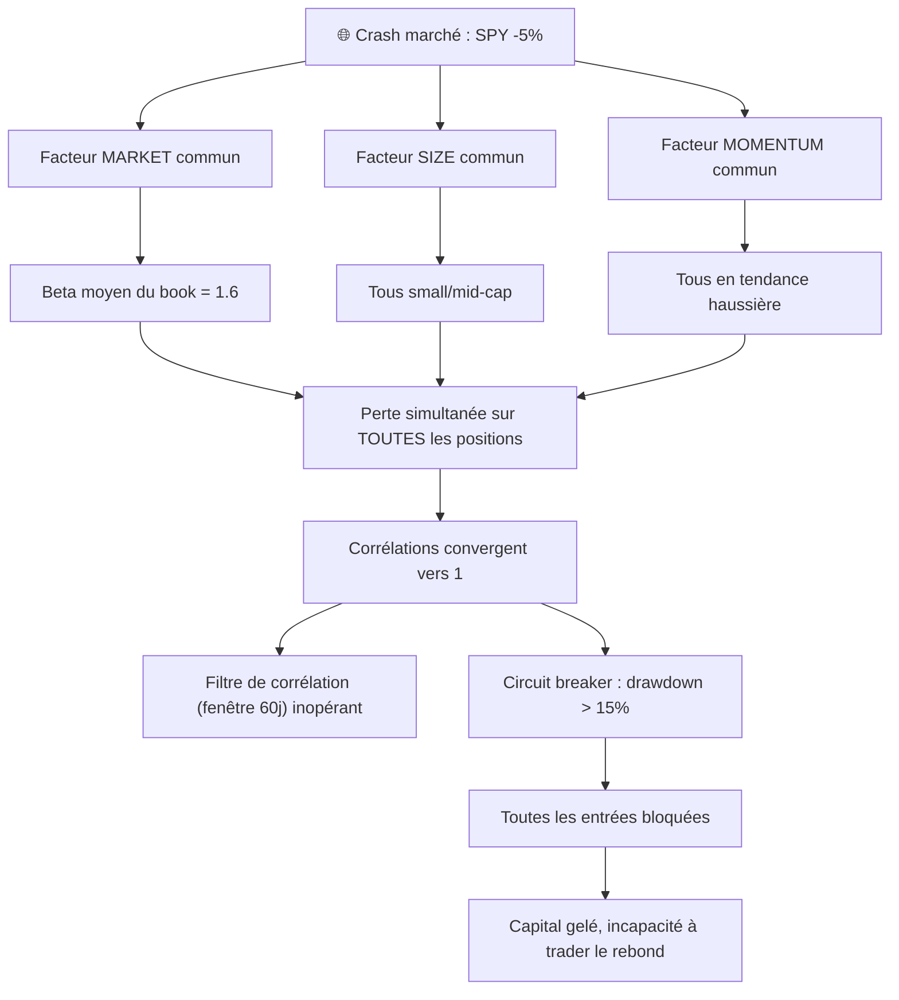

# RisqueSectoriel — Neutralisation des biais de Style / Risque

> **Date** : 2026-06-22
> **Statut** : Analyse + Plan d'action
> **Audit** : Basé sur le code source (source de vérité)

---

## 1. Contexte et problématique

La neutralisation sectorielle (z-score intra-secteur + round-robin avec plafond) est bien gérée dans le codebase actuel. Mais la **neutralisation des facteurs de style** (taille, value, momentum de marché, beta, volatilité) est absente.

**Risque concret** : si le marché s'effondre, toutes les actions du portefeuille peuvent baisser en même temps à cause de **corrélations cachées** — des titres apparemment diversifiés (secteurs différents) mais tous exposés aux mêmes facteurs de risque systématique (small-cap, high-beta, momentum).

---

## 2. État des lieux — ce qui existe (code source)

### 2.1 ✅ Neutralisation sectorielle cross-sectional

**Fichier** : `selector/ranking.py` → `apply_factor_neutralization()`

```python
def _intra_sector_zscore(series: pd.Series) -> pd.Series:
    """Z-score robuste par secteur (ddof=0, fallback 0.0 si std≈0)."""
    mu = series.mean()
    sigma = series.std(ddof=0)
    if sigma < 1e-9:
        return pd.Series(0.0, index=series.index)
    return (series - mu) / sigma
```

Deux facteurs sont neutralisés par z-score intra-secteur :
- `relative_strength_index` (RSI relatif)
- `total_score` (score composite du screener)

Puis winsorisation + normalisation → `[0, 1]`.

### 2.2 ✅ Plafond sectoriel (round-robin)

**Fichier** : `selector/ranking.py` → `apply_sector_neutrality()`

Sélection round-robin avec `sector_cap_ratio` (30% par défaut) : aucun secteur ne peut représenter plus de 30% de la sélection finale.

### 2.3 ✅ Filtre de corrélation Pearson post-hoc

**Fichier** : `risk_management/correlation_filter.py`

```python
def filter_correlated(
    candidates: list[EnrichedCandidate],
    return_matrix: pd.DataFrame,
    threshold: float,        # défaut 0.80
    min_overlap: int,        # défaut 40 jours
) -> tuple[list[EnrichedCandidate], list[CorrelationRejection]]:
```

- Matrice de rendements construite sur `close.pct_change()` (convention *price-only*)
- Algorithme greedy : si un candidat a une corrélation > 0.80 avec un candidat déjà retenu → rejeté
- Fenêtre glissante : 60 jours (`correlation_lookback_days`), minimum 40 jours de chevauchement

### 2.4 ✅ Scoring défensif par régime de marché

**Fichier** : `selector/regime_scoring.py`

En régime `capital_preservation` ou via le `MomentumRotationState` (rotation factor) :

| Facteur | Poids Normal | Poids Défensif |
|---|---|---|
| `trend_vcp` (momentum) | 50% | 25% |
| `total_score` | 30% | 15% |
| `rsi` | 20% | 10% |
| `defensive_beta` | 0% | **22%** |
| `defensive_size` | 0% | **13%** |
| `defensive_low_vol` | 0% | **15%** |

Filtres défensifs additionnels : market_cap ≥ 2B$, beta ≤ 1.2, spread ≤ 15bps, ATR ≤ 6%.

Le `MomentumRotationState` peut forcer cette rotation même en régime `normal` si le momentum du portefeuille sous-performe (< -3% sur 4 semaines).

### 2.5 ✅ Circuit breaker drawdown

**Fichier** : `risk_management/circuit_breaker.py` — bloque les entrées si drawdown > seuil.

---

## 3. Ce qui MANQUE — la neutralisation Style / Risque factorielle

### 3.1 Tableau de couverture

| Capacité | Présent ? | Détail |
|---|---|---|
| Neutralisation sectorielle (z-score) | ✅ | Deux facteurs : RSI, total_score |
| Plafond sectoriel (round-robin) | ✅ | sector_cap_ratio = 30% |
| Filtre corrélation Pearson | ✅ | Post-hoc, greedy, 60j, seuil 0.80 |
| Scoring défensif (beta/size/low-vol) | ✅ | Réactif uniquement (changement de régime) |
| **Factor exposures** (size, value, mom, quality, low-vol) | ❌ | Aucun calcul des loadings factoriels |
| **Factor covariance matrix** | ❌ | Pas de matrice de covariance des rendements factoriels |
| **Specific / idiosyncratic risk** | ❌ | Pas de décomposition risque systématique vs spécifique |
| **Risk decomposition** (factor risk + stock-specific) | ❌ | Le risque portefeuille n'est pas décomposé |
| **Targeted factor neutralization** | ❌ | Impossible de construire un portefeuille beta-neutral |
| **Stress-correlation adaptative** | ❌ | Seuil de corrélation fixe (0.80), non sensible au VIX |

### 3.2 Pourquoi c'est dangereux — le scénario du krach

Prenons un exemple concret :

```
Portefeuille de 15 titres après sélection :
┌─────────────────────────────────────────────────────────┐
│ Secteur        │ Ticker │ Beta  │ Market Cap │ Style    │
├─────────────────────────────────────────────────────────┤
│ Tech           │ AAPL   │ 1.3   │ 2800B      │ Growth   │
│ Tech           │ NVDA   │ 1.7   │ 1200B      │ Growth   │
│ Finance        │ JPM    │ 1.2   │ 500B       │ Value    │
│ Health         │ LLY    │ 0.4   │ 800B       │ Quality  │
│ Consumer       │ TSLA   │ 2.1   │ 600B       │ Growth   │
│ Energy         │ XOM    │ 0.9   │ 450B       │ Value    │
│ ...            │ ...    │ ...   │ ...        │ ...      │
└─────────────────────────────────────────────────────────┘
```

✅ La **neutralisation sectorielle** garantit qu'on n'a pas 10 titres Tech.
✅ Le **filtre de corrélation** élimine les paires trop corrélées sur 60 jours.

❌ Mais si les 15 titres retenus sont tous **high-beta, small/mid-cap, momentum** (quel que soit leur secteur) :

```
Marché SPY : -5% en une journée
  → Beta moyen du book = 1.6
  → Perte attendue du book ≈ -8% (1.6 × -5%)
  → Tous les titres chutent simultanément
  → Corrélation réalisée → 1 (convergence en stress)
  → Circuit breaker déclenché
```

Le filtre de corrélation sur 60 jours **ne peut pas anticiper** la convergence brutale des corrélations en période de stress. La fenêtre historique capture un régime normal, pas le régime de crise.

### 3.3 Diagramme de la chaîne de défaillance



---

## 4. Plan d'action — Priorité 3 (long terme)

## Modèle de risque factoriel simplifié (CWMS)

### 4.1 Pourquoi la priorité 3 est la solution complète

Les priorités 1 et 2 sont des **palliatifs** qui adressent les symptômes, pas la cause racine :

| Solution | Ce qu'elle fait | Limite |
|---|---|---|
| **P1** : Check d'exposition factorielle simple | Agrège beta/size/momentum moyens du book et log un warning | Constat passif, ne corrige pas le portefeuille |
| **P2** : Corrélation adaptative (seuil VIX-dépendant) | Durcit le seuil de rejet de corrélation en période stress | Reste une mesure sur corrélations *totales* (prix), ne distingue pas la source de la corrélation (facteur commun vs coïncidence) |

**P3** attaque le problème à la racine : si on connaît les expositions factorielles de chaque titre et la matrice de covariance des facteurs, on peut :

1. **Mesurer** le risque systématique vs spécifique du portefeuille
2. **Contraindre** les expositions factorielles agrégées (ex: beta book ≤ 1.0)
3. **Décomposer** la corrélation entre deux titres en part factorielle + part idiosyncratique
4. **Anticiper** le comportement du book en stress (covariance conditionnelle)

**⇒ Une fois P3 implémenté correctement, P1 et P2 deviennent redondants.**

### 4.2 Architecture cible : modèle CWMS à 4 facteurs

```
CWMS = Country + World + Market-cap + Style
```

On simplifie à un **modèle à 4 facteurs linéaires** applicable à l'univers US equities :

$$r_i = \beta_i^{\text{mkt}} \cdot f_{\text{mkt}} + \beta_i^{\text{size}} \cdot f_{\text{size}} + \beta_i^{\text{mom}} \cdot f_{\text{mom}} + \beta_i^{\text{value}} \cdot f_{\text{value}} + \varepsilon_i$$

Où :
- $r_i$ : rendement excédentaire du titre $i$ (vs risk-free)
- $f_{\text{mkt}}$ : rendement du marché (SPY excess return)
- $f_{\text{size}}$ : facteur taille (SMB — Small Minus Big)
- $f_{\text{mom}}$ : facteur momentum (WML — Winners Minus Losers)
- $f_{\text{value}}$ : facteur value (HML — High Minus Low, ou P/E, P/B)
- $\varepsilon_i$ : rendement idiosyncratique (spécifique au titre)

La **matrice de covariance du portefeuille** se décompose alors :

$$\Sigma_{\text{port}} = \mathbf{B} \cdot \mathbf{F} \cdot \mathbf{B}^T + \mathbf{S}$$

Où :
- $\mathbf{B}$ : matrice des expositions factorielles $(N \times K)$
- $\mathbf{F}$ : matrice de covariance des facteurs $(K \times K)$
- $\mathbf{S}$ : matrice diagonale des risques spécifiques $(N \times N)$

### 4.3 Données nécessaires

| Donnée | Disponible ? | Source dans le codebase |
|---|---|---|
| `beta_126` (vs SPY) | ✅ Déjà calculé | `selector/factors.py` → `compute_beta_126()` |
| `market_cap` | ✅ Déjà disponible | `stock_metadata` → `market_cap` |
| `trend_score` (proxy momentum) | ✅ Déjà calculé | `selector/factors.py` → `trend_score` |
| `close` quotidien | ✅ | `stock_bars_daily` |
| Prix SPY | ✅ | Présent dans l'univers |
| **Facteur Value (P/E, P/B)** | ⚠️ À ajouter | `stock_fundamentals` (si dispo) ou proxy via earnings yield |
| **Rendements factoriels historiques** | ⚠️ À construire | Calcul à partir des données existantes |

### 4.4 Implémentation — Phases

#### Phase A : Chargement des exposures factorielles

**Nouveau fichier** : `risk_management/factor_model.py`

```python
@dataclass(frozen=True, slots=True)
class FactorExposures:
    """Expositions factorielles normalisées pour un titre à une date donnée."""
    symbol: str
    date: date
    market_beta: float        # beta_126 (déjà calculé)
    size_exposure: float      # z-score log(market_cap) cross-sectional
    momentum_exposure: float  # z-score trend_score cross-sectional
    value_exposure: float     # z-score earnings_yield ou P/E inversé


def compute_factor_exposures(
    symbols: list[str],
    as_of: date,
    market_data: pd.DataFrame,
) -> pd.DataFrame:
    """
    Calcule les exposures factorielles normalisées (z-score cross-sectional)
    pour les 4 facteurs CWMS.

    Returns
    -------
    pd.DataFrame avec colonnes :
        symbol, date, market_beta, size_exposure,
        momentum_exposure, value_exposure
    """
```

**Logique** :
- `market_beta` : déjà calculé par `compute_beta_126()` vs SPY → winsorisé [0.01, 0.99]
- `size_exposure` : `log(market_cap)` → z-score cross-sectional → $\mathcal{N}(0,1)$
- `momentum_exposure` : `trend_score` → z-score cross-sectional → $\mathcal{N}(0,1)$
- `value_exposure` : earnings yield (ou P/E inversé) → z-score cross-sectional → $\mathcal{N}(0,1)$

#### Phase B : Estimation de la covariance factorielle

```python
@dataclass(frozen=True, slots=True)
class FactorCovariance:
    """Matrice de covariance factorielle + risques spécifiques."""
    factor_cov: np.ndarray        # (K, K)
    factor_names: list[str]       # ['market', 'size', 'momentum', 'value']
    specific_risks: dict[str, float]  # symbole → variance spécifique
    estimation_date: date
    lookback_days: int
    ewma_half_life: int            # demi-vie EWMA (défaut 60 jours)


def estimate_factor_covariance(
    factor_returns: pd.DataFrame,      # colonnes = facteurs, index = dates
    lookback_days: int = 252,
    ewma_half_life: int = 60,
) -> FactorCovariance:
    """
    Estime la matrice de covariance factorielle avec EWMA
    (poids exponentiels décroissants, plus de poids aux observations récentes).
    """
```

**Pourquoi EWMA** : donne plus de poids aux observations récentes → la covariance capte naturellement les régimes de stress (volatilité et corrélations factorielles augmentent).

#### Phase C : Décomposition du risque portefeuille

```python
@dataclass(frozen=True, slots=True)
class PortfolioRiskDecomposition:
    """Décomposition complète du risque portefeuille."""
    total_variance: float
    total_volatility: float           # sqrt(total_variance), annualisé
    systematic_variance: float         # part factorielle
    specific_variance: float           # part idiosyncratique
    systematic_pct: float              # % du risque total
    factor_contributions: dict[str, float]  # contribution par facteur
    concentration_herfindahl: float    # Herfindahl des poids
    warnings: list[str]                # alertes (beta trop élevé, etc.)


def decompose_portfolio_risk(
    weights: dict[str, float],          # symbole → poids dans le book
    exposures: dict[str, FactorExposures],
    factor_cov: FactorCovariance,
    specific_risks: dict[str, float],
) -> PortfolioRiskDecomposition:
    """
    Décompose le risque total du portefeuille en :
    - Risque systématique (factoriel) : w^T B F B^T w
    - Risque spécifique (idiosyncratique) : sum(w_i^2 * s_i^2)
    """
```

#### Phase D : Contraintes factorielles dans le PortfolioBuilder

**Modification** : `risk_management/portfolio_builder.py`

Ajouter une étape avant le sizing qui vérifie les contraintes factorielles :

```python
# Dans build_target_portfolio(), après enrichissement des candidats :
factor_check = check_factor_constraints(
    candidates=accepted,
    factor_model=factor_model,
    constraints={
        "max_portfolio_beta": 1.2,        # beta moyen pondéré ≤ 1.2
        "max_size_concentration": 0.6,     # max 60% du risque vient du size
        "max_momentum_concentration": 0.5, # max 50% du risque vient du momentum
        "min_factor_diversification": 2,   # au moins 2 facteurs avec contrib > 10%
    },
)
if factor_check.violations:
    # Rejeter les candidats qui aggravent les violations
    accepted = factor_check.filtered_candidates
```

#### Phase E : Remplacement du filtre de corrélation

Le filtre de corrélation Pearson actuel (`correlation_filter.py`) peut être **remplacé** par le modèle factoriel :

```python
def filter_by_factor_correlation(
    candidates: list[EnrichedCandidate],
    exposures: dict[str, FactorExposures],
    factor_cov: FactorCovariance,
    max_factor_correlation: float = 0.70,
) -> list[EnrichedCandidate]:
    """
    Filtre les candidats en utilisant la corrélation IMPLIÉE par le modèle
    factoriel (plutôt que la corrélation historique des prix).

    La corrélation implicite entre deux titres i et j est :
        corr_ij = (B_i · F · B_j^T) / (σ_i · σ_j)
    où σ_i = sqrt(B_i · F · B_i^T + s_i^2)
    """
```

**Avantages** par rapport au filtre Pearson actuel :
1. Distingue corrélation *factorielle* (structurelle) vs *idiosyncratique* (bruit)
2. L'EWMA sur F capture automatiquement les changements de régime
3. Moins de faux positifs (deux titres peuvent être corrélés par le prix sans l'être structurellement)
4. Plus robuste en petit échantillon (on estime F sur N facteurs, pas N×N titres)

### 4.5 Calendrier d'implémentation

| Phase | Fichier(s) | Effort estimé | Dépendances |
|---|---|---|---|
| **A** : Expositions factorielles | `risk_management/factor_model.py` (nouveau) | 2-3 jours | `selector/factors.py`, `stock_metadata` |
| **B** : Covariance factorielle EWMA | `risk_management/factor_model.py` | 1-2 jours | Phase A |
| **C** : Décomposition risque | `risk_management/factor_model.py` | 1-2 jours | Phase B |
| **D** : Contraintes dans PortfolioBuilder | `risk_management/portfolio_builder.py` | 2-3 jours | Phase C |
| **E** : Remplacement filtre corrélation | `risk_management/correlation_filter.py` (modif) | 1-2 jours | Phase C |
| **Tests + Backtest** | `tests/test_factor_model.py` | 3-5 jours | Phases A-E |
| **Total** | | **10-17 jours** | |

### 4.6 Indicateurs de succès

Après implémentation, le `PortfolioRiskDecomposition` doit afficher pour chaque séance :

```
Portefeuille 2026-06-22 :
  Volatilité totale      : 18.2% ann.
  Risque systématique    : 14.1% (77.5%)
    ├─ Market            :  8.2% (45.1%)
    ├─ Size              :  3.1% (17.0%)
    ├─ Momentum          :  2.0% (11.0%)
    └─ Value             :  0.8% ( 4.4%)
  Risque spécifique      :  4.1% (22.5%)
  Herfindahl (concentration) : 0.12
  ✅ Aucune violation de contrainte factorielle
```

---

## 5. Résumé : P1 et P2 sont-ils nécessaires si P3 est fait ?

**Non.** P3 est la solution structurelle qui subsume P1 et P2 :

| Priorité | Remplacée par P3 ? | Comment |
|---|---|---|
| **P1** — Check d'exposition factorielle | ✅ Oui | La décomposition de risque (Phase C) fournit un monitoring bien plus riche et actionnable que le simple warning de P1 |
| **P2** — Corrélation adaptative VIX | ✅ Oui | L'EWMA sur la covariance factorielle (Phase B) capture automatiquement l'augmentation des corrélations en période de stress, sans seuil arbitraire |
| **P3** — Modèle factoriel complet | 🎯 Cible | Solution unifiée qui mesure, contraint, et anticipe le risque factoriel |

**Recommandation** : aller directement sur P3. Les efforts de P1 et P2 seraient du code jetable une fois P3 en place.

---

## 6. Prérequis et questions ouvertes

1. **Données Value** : Avons-nous accès à P/E, P/B, ou earnings yield dans `stock_fundamentals` ou via le provider EODHD/Finnhub ? Sinon, le facteur value peut être omis dans une V1 (modèle à 3 facteurs : Market + Size + Momentum).

2. **Rendement risk-free** : Pour calculer les excess returns factoriels, un proxy taux sans risque est nécessaire (ex: taux 3-month T-bill). Est-ce disponible ?

3. **Fenêtre d'estimation** : 252 jours (1 an) avec EWMA half-life de 60 jours semble raisonnable pour un portefeuille swing (hold 5-20 jours). À calibrer en backtest.

4. **Backtesting** : Le modèle factoriel doit être intégré dans `backtesting/risk_bridge.py` pour que les runs historiques reflètent les contraintes factorielles.

---

## 7. Fichiers impactés

| Fichier | Action | Description |
|---|---|---|
| `risk_management/factor_model.py` | **Nouveau** | Expositions, covariance, décomposition risque |
| `risk_management/portfolio_builder.py` | **Modifier** | Ajouter contraintes factorielles dans `build_target_portfolio()` |
| `risk_management/correlation_filter.py` | **Modifier** | Optionnel : remplacer Pearson par corrélation implicite du modèle |
| `risk_management/config.py` | **Modifier** | Ajouter `RiskConfig` paramètres : `enable_factor_model`, `max_portfolio_beta`, etc. |
| `risk_management/models.py` | **Modifier** | Ajouter `FactorExposures`, `PortfolioRiskDecomposition` |
| `backtesting/risk_bridge.py` | **Modifier** | Intégrer le modèle factoriel dans le bridge backtest |
| `tests/test_factor_model.py` | **Nouveau** | Tests unitaires et propriété-based |
| `selector/factors.py` | **Modifier** | Exporter `beta_126`, `trend_score`, `market_cap` comme exposures |
| `database/` | **Possible** | Si les données value nécessitent une nouvelle table |

---

## 8. Références

- **Code source secteur** : `selector/ranking.py` — `apply_factor_neutralization()`, `apply_sector_neutrality()`
- **Code source corrélation** : `risk_management/correlation_filter.py` — `filter_correlated()`
- **Code source régime** : `selector/regime_scoring.py` — `apply_regime_weights()`, `CAPITAL_PRESERVATION_WEIGHTS`
- **Code source portefeuille** : `risk_management/portfolio_builder.py` — `PortfolioBuilder`
- **Code source sizing** : `risk_management/kelly.py`, `risk_management/position_sizer.py`
- **Doc fonctionnelle** : `doc/DOC_FONCTIONNELLE.md`
- **Doc selector** : `doc/selector.md`
- **Audit selector antérieur** : `prompt/archive/refactor/audit_selector.md` (section 2.5 — risques neutralisation sectorielle)
